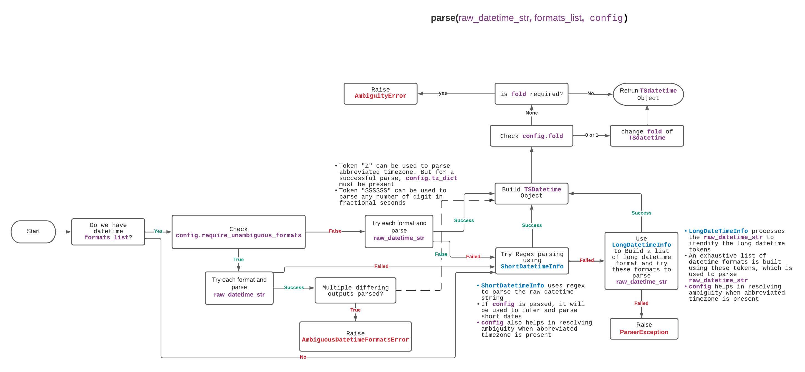

# TS Datetime Parser

- [Datetime Parser](#datetime-parser)
- [Parsing With Formats](#parsing-with-formats)
- [Parsing Fractional Seconds](#parsing-fractional-seconds)
- [Parsing Abbreviated Timezones](#parsing-abbreviated-timezones)
- [Unambiguous Datetime](#unambiguous-datetime)
- [Ambiguous Datetime](#ambiguous-datetime)
- [Resolving Ambiguous Dates with DatetimeConfig](#resolving-ambiguous-dates-with-datetimeconfig)
- [Working with TSDatetime](#working-with-tsdatetime)
- [DatetimeConfig](#datetimeconfig)
- [Limitations](#limitations)

## Datetime Parser

`taskscript_utils.datetime_parser` exposes `parse()` method for parsing string datetimes.

The `parse()` returns a `TSDatetime` object and accepts following arguements:

- `datetime_raw_str: str`: raw datetime string to be parsed.
- `formats_list: Sequence[str] (optional)`: You can optionally pass a list of formats to try to parse datetime string. If `datetime_raw_str` doesn't matches with any format, the datetime parser will still try to parse `datetime_raw_str` with other methods such as using regex and trying long datetime format
- `config: DatetimeConfig (optional)`: You also have an options to pass `DatetimeConfig`. It provides complementary information on how to mark parsed digits as day, month or year and also provide an options to handle abbreviated time zones and fold for parsing ambiguous timestamps during daylight saving transitions. Ideally, DatetimeConfig should be constructed from pipeline configuration passed to task scripts



## Parsing With Formats

```Python
from task_script_utils.datetime_parser import parse
datetime_formats_list = [
    "DD-MM-YY HH:mm:ss z",
]

# Case 1: when raw datetime string matches with one of the format in datetime_formats_list
>>> result = parse("21-12-20 12:30:20 Asia/Kolkata", formats_list=datetime_formats_list)
>>> result.tsformat()
'2020-12-21T07:00:20Z'
>>> result.isoformat()
'2020-12-21T12:30:20+05:30'

# Case 2: when raw datetime string doesn't match with one of the format
# in datetime_formats_list but can be parsed without any ambiguity
# In this case, it can be inferred that year is 2020, day is 21 and hence
# month is 12 This is just an example and there could be multiple cases
# that may lead to ambiguity or invalid datetime.
# These are discussed in later sections of this documents
>>> result = parse("21-12-2020 12:30:20 PM America/Chicago", formats_list=datetime_formats_list)
>>> result.isoformat()
'2020-12-21T12:30:20-06:00'
>>> result.tsformat()
'2020-12-21T18:30:20Z'

# Case 3: when raw datetime string doesn't match with one of the format
# in datetime_formats_list and is ambiguous.
# This is just an example and there could be multiple cases that may
# lead to ambiguity or invalid datetime.
# These are discussed in later sections of this documents
>>> result = parse("21-12-20 12:30:20 PM America/Chicago", formats_list=datetime_formats_list)
'''
Traceback (most recent call last):
 ...
task_script_utils.datetime_parser.parser_exceptions.AmbiguousDateError:
Ambiguous date:21-12-20, possible formats: ('MM-DD-YY', 'YY-MM-DD', 'DD-MM-YY')
'''
```

The following tokens are currently supported:

|                            | Token  | Output                            |
| -------------------------- | ------ | --------------------------------- |
| **Year**                   | YYYY   | 2000, 2001, 2002 ... 2012, 2013   |
|                            | YY     | 00, 01, 02 ... 12, 13             |
|                            | Y      | 2000, 2001, 2002 ... 2012, 2013   |
| **Quarter**                | Q      | 1 2 3 4                           |
|                            | Qo     | 1st 2nd 3rd 4th                   |
| **Month**                  | MMMM   | January, February, March ...      |
|                            | MMM    | Jan, Feb, Mar ...                 |
|                            | MM     | 01, 02, 03 ... 11, 12             |
|                            | M      | 1, 2, 3 ... 11, 12                |
|                            | Mo     | 1st 2nd ... 11th 12th             |
| **Day of Year**            | DDDD   | 001, 002, 003 ... 364, 365        |
|                            | DDD    | 1, 2, 3 ... 4, 5                  |
| **Day of Month**           | DD     | 01, 02, 03 ... 30, 31             |
|                            | D      | 1, 2, 3 ... 30, 31                |
|                            | Do     | 1st, 2nd, 3rd ... 30th, 31st      |
| **Day of Week**            | dddd   | Monday, Tuesday, Wednesday ...    |
|                            | ddd    | Mon, Tue, Wed ...                 |
|                            | dd     | Mo, Tu, We ...                    |
|                            | d      | 0, 1, 2 ... 6                     |
| **Days of ISO Week**       | E      | 1, 2, 3 ... 7                     |
| **Hour**                   | HH     | 00, 01, 02 ... 23, 24             |
|                            | H      | 0, 1, 2 ... 23, 24                |
|                            | hh     | 01, 02, 03 ... 11, 12             |
|                            | h      | 1, 2, 3 ... 11, 12                |
| **Minute**                 | mm     | 00, 01, 02 ... 58, 59             |
|                            | m      | 0, 1, 2 ... 58, 59                |
| **Second**                 | ss     | 00, 01, 02 ... 58, 59             |
|                            | s      | 0, 1, 2 ... 58, 59                |
| **Fractional Second**      | SSSSSS | All fractional digits             |
| **AM / PM**                | A      | AM, PM                            |
| **Timezone**               | Z      | -07:00, -06:00 ... +06:00, +07:00 |
|                            | ZZ     | -0700, -0600 ... +0600, +0700     |
|                            | z      | Asia/Baku, Europe/Warsaw, GMT ... |
|                            | zz     | EST CST ... MST PST               |
| **Seconds timestamp**      | X      | 1381685817, 1234567890.123        |
| **Milliseconds timestamp** | x      | 1234567890123                     |

**Note: If `zz` token is used in format string, passing `tz_dict` is a must.**

## Parsing Fractional Seconds

You can use `SSSSSS` as a token to parse any number on digits as fractional seconds.
`TSDatetime` object returned by `parse()` helps maintaining the precision of fractional seconds.

For example, in the examples below `result.isoformat()` and `result.tsformat()` maintains the number of digits in fractional seconds.
This is different from python's `datetime` object, which only allows 6 digits for microseconds.
This is visible as the result of `result.datetime.isoformat()`, where `result.datetime` property return pythonic `datetime` object

```python
>>> from task_script_utils.datetime_parser import parse
>>> datetime_formats_list = [
    "DD-MM-YY HH:mm:ss.SSSSSS z",
]

# Example 1
>>> result = parse("2021-12-13T13:00:12.19368293274 Asia/Kolkata")
>>> result.tsformat()
'2021-12-13T07:30:12.19368293274Z'
>>> result.isoformat()
'2021-12-13T13:00:12.19368293274+05:30'
>>> result.datetime.isoformat()
'2021-12-13T13:00:12.193682+05:30'

# Example 2
>>> result = parse("2021-12-13T13:00:12.1 Asia/Kolkata")
>>> result.isoformat()
'2021-12-13T13:00:12.1+05:30'
>>> result.tsformat()
'2021-12-13T07:30:12.1Z'
>>> result.datetime.isoformat()
'2021-12-13T13:00:12.100000+05:30'
```

## Parsing Abbreviated Timezones

The only way to parse timestamps (if parse-able) is by passing `DatetimeConfig` object with `tz_dict`.
`DatetimeConfig.tz_dict` is a `dict` mapping abbreviated_tz to offset value. Defaults to `empty dict`.

```python
>>> from task_script_utils.datetime_parser import (
  parse,
  DatetimeConfig
)
>>> sample_tz_dict = {
...     "IST": "+05:30",
...     "EST": "-05:00",
...     "CST": "-06:00",
... }
>>> dt_config = DatetimeConfig(
...     tz_dict=sample_tz_dict
... )
>>> result = parse("2021-12-25T00:00:00 IST", config=dt_config)
>>> result.isoformat()
'2021-12-25T00:00:00+05:30'
>>> result.tsformat()
'2021-12-24T18:30:00Z'

# An exception will be raised if DatetimeConfig.tz_dict doesn't contain the abbreviated tz
result = parse("2021-12-12 14:15:16 BRST", config=dt_config)
'''
Traceback (most recent call last):
...
task_script_utils.datetime_parser.parser_exceptions.OffsetNotKnownError: Offset value not known for 'BRST'
'''
```

`"Z"` can be used as token for capturing abbreviated timezones when using datetime_formats to parse the raw datetime string. Even in this case, for successful parsing, `DatetimeConfig.tz_dict` is required

```python
>>> dt_formats_list = [
...     "YYYY-MM-DD HH:mm:ss Z"
... ]
>>> result = parse("2021-12-12 14:15:16 CST", formats_list=dt_formats_list, config=dt_config)
>>> result.isoformat()
'2021-12-12T14:15:16-06:00'
# Similar to example above, an exception will be raised if
# DatetimeConfig.tz_dict doesn't contain the abbreviated tz.

```

## Unambiguous Datetime

You can just pass the `datetime_raw_str` to `parse()` and it will parse it if there is no ambiguity.
Examples:
| Raw Datetime | `isoformat` result | Note |
| --------------------------------------------------- | -------------------------------- | ----------------------------------------------------- |
| 2021-12-13T12:12:12 America/Chicago | 2021-12-13T12:12:12-06:00 | Parsed as YYYY-MM-DD |
| 2021-13-12T12:12:12 America/Chicago | 2021-12-13T12:12:12-06:00 | Parsed as YYYY-DD-MM as date doesn't match YYYY-MM-DD |
| 27-12-2002 11:12:12 PM America/Chicago | 2002-12-27T23:12:12-06:00 | |
| 12:12:12Z 27-12-2002 | 2002-12-27T12:12:12+00:00 | |
| 2021-13-12T12:12:12Z | 2021-12-13T12:12:12+00:00 | |
| 12-12-2002T12:12:12.435324 America/Chicago | 2002-12-12T12:12:12.435324-06:00 | |
| 41-12-21 04:03:00 | 2041-12-21T04:03:00 | We can clearly tell year=41, day=21 and month=12 |
| May 26th 2013 12:12:12.0001 AM Asia/Kolkata | 2013-05-26T00:12:12.0001+05:30 | |
| Sunday, May 26th 2013 13:12:12 | 2013-05-26T13:12:12 | |
| Sunday, May 26th 2013 12:12:12 AM Asia/Kolkata | 2013-05-26T00:12:12+05:30 | |
| Sunday, May 26th, 2013 12:12:12 AM Asia/Kolkata | 2013-05-26T00:12:12+05:30 | |
| Sunday, May 26 2013 12:12:12 AM Asia/Kolkata | 2013-05-26T00:12:12+05:30 | |
| Sunday, May 26 2013 12:12:12.5677 AM Asia/Kolkata | 2013-05-26T00:12:12.5677+05:30 | |
| Sunday, May 26th 2013 12:12:12.5677 AM Asia/Kolkata | 2013-05-26T00:12:12.5677+05:30 | |

## Ambiguous Dates

If `formats_list` doesn't contain a match or is not passed, `parse` will use regex to parse the raw datetime string.
The regex parsing allows to capture digits of short formatted dates. The captured digits can all be two digits or one of them could be 4 digits long representing year.
Sometimes, it is hard to infer day, month and year from the parsed digits and this leads to ambiguity during parsing.

Following are some examples of ambiguous cases

| Cases                                      | Reason for ambiguity                                                                              | Note                                           |
| ------------------------------------------ | ------------------------------------------------------------------------------------------------- | ---------------------------------------------- |
| 21-12-2T13:14:16                           | **Ambiguity**: fits in more than one of the format: ('MM-DD-YY', 'YY-MM-DD', 'DD-MM-YY')          |
| 21-23-2020T12:13:14                        | Year = 2020, but can't decide day and month between: ('21', '23')                                 |
| 2021-23-13T01:23:43                        | Year = 2021, but can't decide day and month between: ('23', '13')                                 |
| 27-12-2002 12:12:12 CDT                    | **OffsetNotKnownError**: Offset value not known for 'CDT'                                         | Can be fixed by passing DatetimeConfig.tz_dict |
| 27-12-2002 13:12:12 AM America/Chicago     | **InvalidTimeError**: Hour is 13 but meridiem is AM                                               |
| 2021-10-31T02:45:00 Europe/Rome            | **AmbiguousFoldError**: DatetimeConfig.fold must not be None to parse datetime without ambiguity. | Can be fixed by passing DatetimeConfig.fold    |
| Oct 31st 2021 02:45:00.5677 AM Europe/Rome | **AmbiguousFoldError**: DatetimeConfig.fold must not be None to parse datetime without ambiguity. | Can be fixed by passing DatetimeConfig.fold    |

## Resolving Ambiguous Dates with `DatetimeConfig`

After parser has extracted date parts using regex, `DatetimeConfig` can be used to handle ambiguous cases by specifying flags like `year_first: Optional[bool]` and `day_first: Optional[bool]`.

- `day_first: Optional[bool]`: `True/False`. Defaults to `None`
  - Whether to interpret the first value in an ambiguous 3-integer date (e.g. 01/05/09) as the day (True) or month (False).
- `year_first: Optional[bool]`: `True/False`. Defaults to `None`
  - Whether to interpret the first value in an ambiguous 3-integer date (e.g. 01/05/09) as the year.

Following table specifies the possible datetime formats depending on the values of `day_first` and `year_first`.

| year_first | day_first | possible formats                                       |
| ---------- | --------- | ------------------------------------------------------ |
| True       | True      | year-day-month                                         |
| True       | False     | year-month-day                                         |
| True       | None      | year-month-day <br> year-day-month                     |
| False      | False     | month-day-year                                         |
| False      | True      | day-month-year                                         |
| False      | None      | month-day-year <br> day-month-year                     |
| None       | True      | day-month-year                                         |
| None       | False     | year-month-day <br> month-day-year                     |
| None       | None      | month-day-year <br> day-month-year <br> year-month-day |

When the year has four digits, then whether `year_first` is `true` or `false`, is decided by regex parsing done by `DatetimeInfo`.
In this case the value of `DatetimeConfig.year_first` is ignored. Only `DatetimeInfo.day_first` is taken into account.
Consider following examples:

| `datetime_raw_str` | `year_first` | `day_first` | `result (year-month-day)` |
| ------------------ | ------------ | ----------- | ------------------------- |
| 2021/02/3 04:03:00 | False        | True        | 2021-03-02T04:03:00       |
| 3/02/2021 04:03:00 | True         | True        | 2021-02-03T04:03:00       |

When `year_first` is `true` and day_first is `None` , `year-month-day` takes precedence over `year-day-month`. eg 20-12-11 satisfies both `year-month-day` and `year-day-month` but is will be parsed as day=11, month=12, year=2020
This can happen in following two cases:

- When `DatetimeConfig.year_first=True` and `DatetimeConfig.day_first=None`
- When `DatetimeConfig` is not provided but regex parsing infers 4 digit year in the beginning. eg 2020-12-11.

For example:

| `datetime_raw_str`  | `year_first` | `day_first` | `result (year-month-day)` |
| ------------------- | ------------ | ----------- | ------------------------- |
| 21-11-12T00:00:00   | True         | None        | 2021-11-12T00:00:00       |
| 2021-11-12T00:00:00 | None         | True        | 2021-02-03T04:03:00       |

For every other cell in the possible formats table with multiple formats, only one of the formats must satisfy the raw datetime string. If None or more that one format satisfies the datetime string, it is still an ambiguous case.

Consider following examples on how `year_first` and `day_first` impacts the parsing result:

| `datetime_raw_str`           | `year_first` | `day_first` | `result (year-month-day)`    |
| ---------------------------- | ------------ | ----------- | ---------------------------- |
| 2021/11/07 04:03:00          | None         | None        | 2021-11-07T04:03:00          |
| 2021/11/07 04:03:00          | None         | True        | 2021-07-11T04:03:00          |
| 11\12\2021 04:03:00          | None         | True        | 2021-12-11T04:03:00          |
| 13/02/03 04:03:00            | None         | True        | 2003-02-13T04:03:00          |
| 01/02/03 04:03:00            | None         | True        | 2003-02-01T04:03:00          |
| 12/13/03 04:03:00            | None         | False       | 2003-12-13T04:03:00          |
| 13-02-03 04:03:00            | None         | False       | 2013-02-03T04:03:00          |
| 2021.11.7 04:03:00           | None         | False       | 2021-11-07T04:03:00          |
| 2021.11.07 04:03:00.00045000 | None         | False       | 2021-11-07T04:03:00.00045000 |
| 01/02/03 04:03:00.0          | True         | None        | 2001-02-03T04:03:00.0        |
| 13/02/03 04:03:00            | True         | None        | 2013-02-03T04:03:00          |
| 13/2/03 04:03:00             | False        | None        | 2003-02-13T04:03:00          |
| 01/02/03 04:03:00            | True         | True        | 2001-03-02T04:03:00          |
| 13/02/03 04:03:00            | True         | True        | 2013-03-02T04:03:00          |
| 1/02/03 04:03:00             | True         | False       | 2001-02-03T04:03:00          |
| 13/02/03 04:03:00 +05:30     | True         | False       | 2013-02-03T04:03:00+05:30    |
| 01/02/03T04:30:00            | False        | True        | 2003-02-01T04:30:00          |
| 01/02/3T04:30:00             | False        | True        | 2003-02-01T04:30:00          |
| 1/2/3T4:30:00                | False        | True        | 2003-02-01T04:30:00          |
| 1/2/3T4:3:00                 | False        | True        | 2003-02-01T04:03:00          |
| 01/02/13T04:03:00            | False        | True        | 2013-02-01T04:03:00          |
| 01/02/03 04:03:00            | False        | True        | 2003-02-01T04:03:00          |
| 13/2/03 04:03:00.43500       | False        | True        | 2003-02-13T04:03:00.43500    |
| 01/02/03 04:03:00            | False        | False       | 2003-01-02T04:03:00          |

<br/>

Defining `year_first` and `day_first` in `DatetimeConfig`, doesn't always guarantee a valid parse.
Consider the examples below:

| `datetime_raw_str`  | `year_first` | `day_first` | `possible formats` | `error`                                                                                     |
| ------------------- | ------------ | ----------- | ------------------ | ------------------------------------------------------------------------------------------- |
| 13/02/3 04:03:00    | False        | False       | MDY                | **InvalidDateError**: month must be in 1..12                                                |
| 2021/32/07 04:03:00 | None         | True        | DMY                | **InvalidDateError**: day is out of range for month, date=('2021', '32', '07')              |
| 2021/11/14 04:03:00 | None         | True        | DMY                | **InvalidDateError**: month must be in 1..12,                                               |
| 01/02/03 04:03:00   | None         | False       | YMD/MDY            | **AmbiguousDateError**: Ambiguous date:01-02-03, possible formats: ('MM-DD-YY', 'YY-MM-DD') |
| 01/02/03 04:03:00   | False        | None        | MDY/DMY            | **AmbiguousDateError**: Can't decide day and month between: ('01', '02')                    |
| 01/15/11 04:03:00   | True         | False       | YMD                | **InvalidDateError**: month must be in 1..12                                                |

## Working with TSDatetime

`parse()` return a `TSDatetime` object.
It has following methods and properties:

- `isoformat()`: return datetime string in ISO format
- `tsformat()`: returns datetime string in Tetrascience's ISO8601 format
- `datetime`: return python `datetime` object.
- `change_fold()`: change the fold value

`TSDatetime` allows us to maintain the precision of fractional seconds. Using `TSDatetime.datetime` return the python's `datetime` object but we might loose the subseconds precision.

## DatetimeConfig

DatetimeConfig is used to provide complementary information that helps
to parse datetime

```python
from task_script_utils.datetime_parser import DatetimeConfig
```

A `DatetimeConfig` object has following attributes:

- `day_first: Optional[bool]`: `True/False`. Defaults to `None`
  - Whether to interpret the first value in an ambiguous 3-integer date (e.g. 01/05/09) as the day (True) or month (False).
- `year_first: Optional[bool]`: `True/False`. Defaults to `None`
  - Whether to interpret the first value in an ambiguous 3-integer date (e.g. 01/05/09) as the year.
- `tz_dict: Optional[dict]`: a `dict` mapping abbreviated_tz to offset value. Defaults to `empty dict`.

```python
  sample_tz_dict = {
      "IST": "+05:30",
      "EST": "-05:00",
      "CST": "-06:00",
  }

  # Inbuilt tz_dict
  from task_script_utils.datetime_parser.tz_dicts import USA
  print(USA)
  {
    "EDT": "-04:00",
    "EST": "-05:00",
    "CDT": "-05:00",
    "CST": "-06:00",
    "MDT": "-06:00",
    "MST": "-07:00",
    "PDT": "-07:00",
    "PST": "-08:00",
  }
```

- `fold: Optional[int]`: `0`, `1`. Defaults to `None`.
  - It is required during the 2 hour window when clocks are set back in a timezone which keeps track of daylight savings (such as IANA timezones like `Europe/London`).
  - The allowed values for the fold attribute will be 0 and 1 with 0 corresponding to the earlier and 1 to the later of the two possible readings of an ambiguous local time.
  - If fold is `None`, Parser will check if `fold` is needed or not to parse the time with no ambiguity.
  - `AmbiguousFoldError` will be raised if `fold` is needed.

## Limitations

1. It is not possible to parse just dates or just times alone.
   eg.`parse('2021-12-08')` or `parse('12:00:00')` will raise `InvalidDateError`
